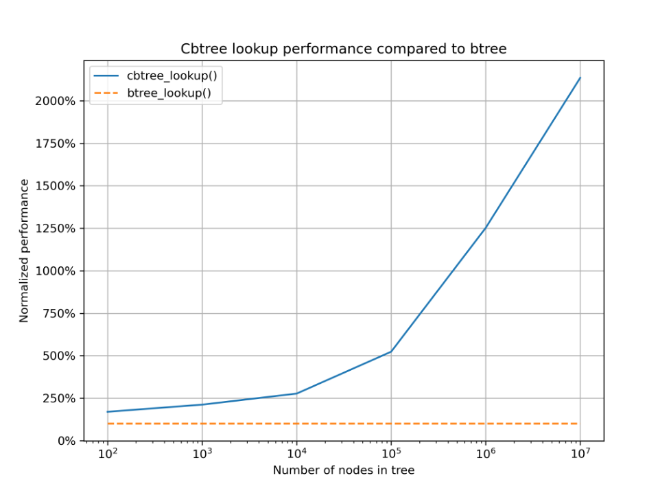
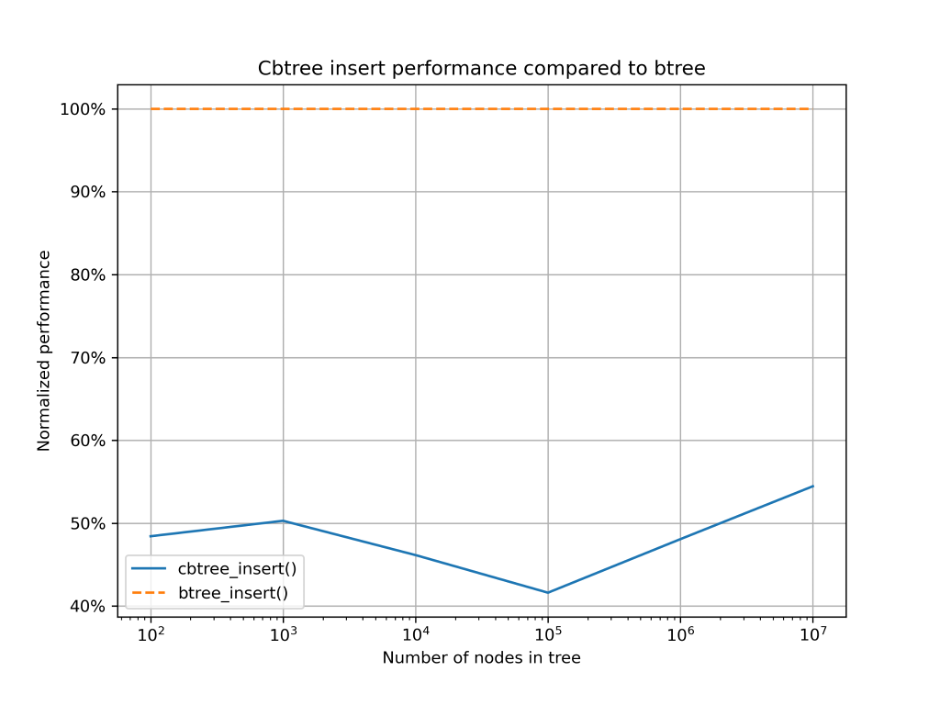
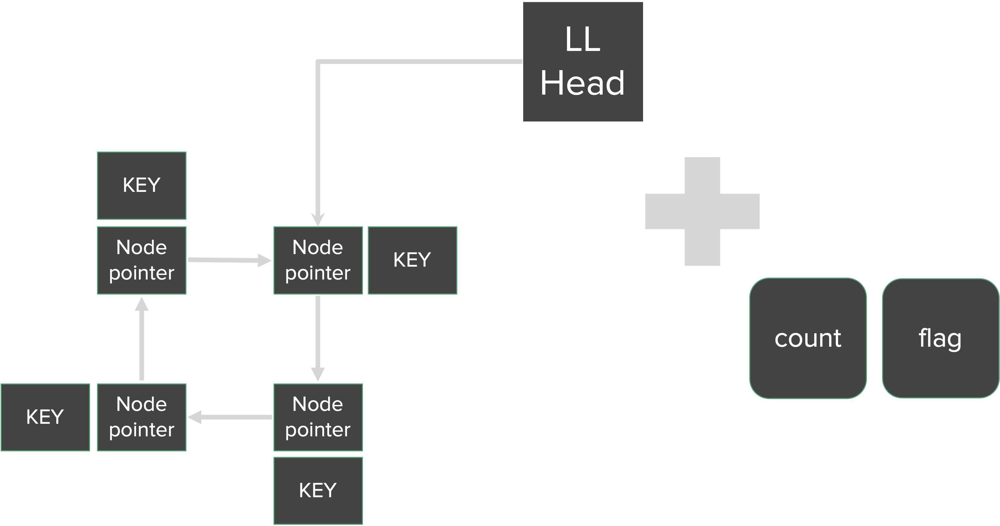

Github[https://github.com/hhfbale/btree_profiling]

# Cached B+ Tree(CBTree)

## Performance

The tests were conducted by inserting numbers from 1 to n sequentially and performing random searches 10n times.
The insertion performance demonstrated a remarkable improvement, achieving a 2000% increase while only doubling the insertion time.



## Concept

CBTree(Cached B+ Tree) is a data structure adjusting cache system into B+ tree.

## Algorithm

- We added a cache into every b+tree node.
- Each cache is configured with a circular linked list with 4 nodes.
  

## Base Code

linux 5.4.214/lib/btree.c

## Test

### Clone

```bash
git clone https://github.com/hhfbale/btree_profiling
cd ./btree_profiling/
```

### Build Kernel Module

`make`

### Run & Check Log

```bash
sudo insmod cbtree.ko
sudo rmmod cbtree.ko
dmesg
```

## Credit

Chung-Ang University Linux System Application Term Project

- [Herman Bale](https://github.com/hhfbale)
- [Jung Jinwook]()
- [Jaehyung Ahn](https://github.com/JayHarrisonAhn)
- [Taehyun Bae](https://github.com/bs06136)
